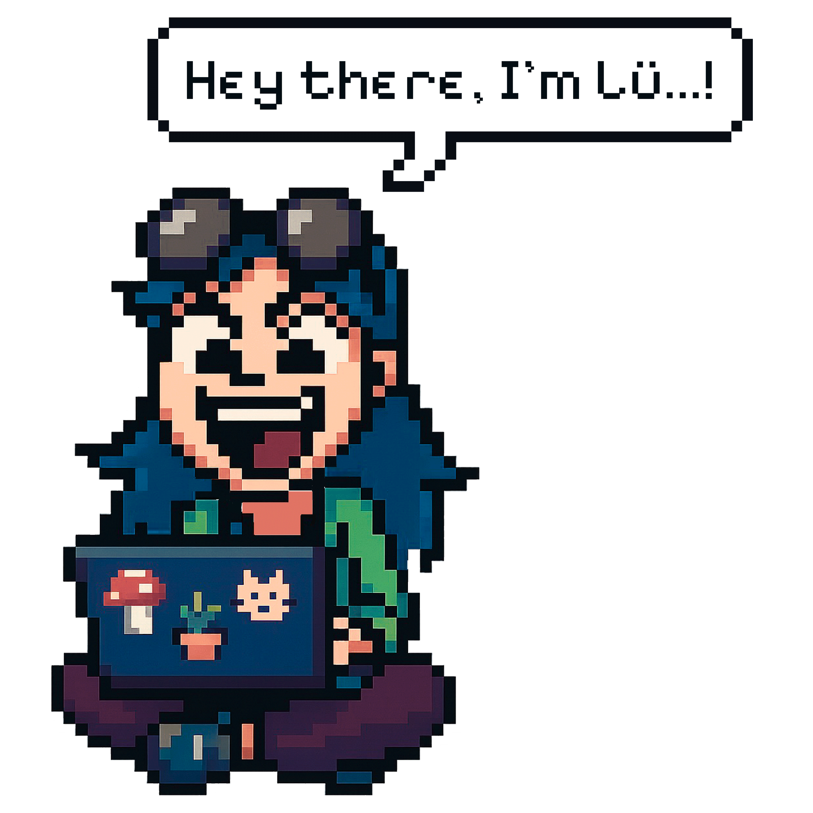

  

  Welcome to my little corner of the internet where I  
  mix design, code, plants, and pixel dreams 🌿✨

  

---

### 🎨 What I love doing

- 🌱 Designing beautiful & playful interfaces
- 💻 Building animated frontends with Vue, Tailwind & GSAP
- 🧠 Learning new things (recently: backend with Node & MongoDB)
- ✏️ Illustrating for fun & magic
- 🧪 Experimenting with SVGs and visual ideas

---

### 🌐 Find me around the web

  
  

> *“Make things with love and pixels — always 🌸”*
